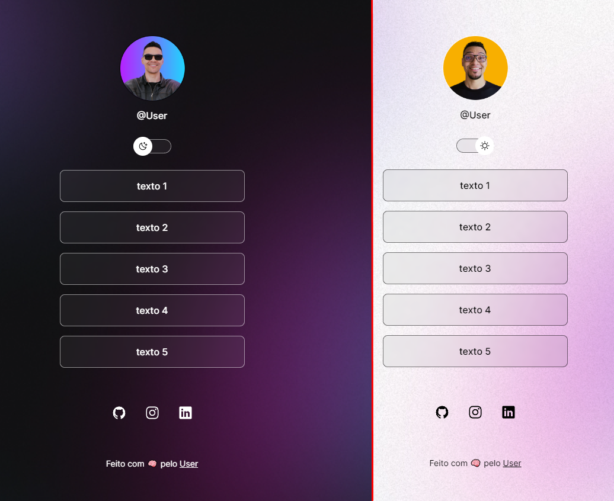

<h1 align="center"> DevLinks </h1>

 

  

## 💻 Projeto

O DevLinks é um agregador de links para usar como cartão de visitas online.

## 🚀 Tecnologias

Esse projeto foi desenvolvido com as seguintes tecnologias:

- HTML e CSS
- JavaScript
- Git e Github

---
